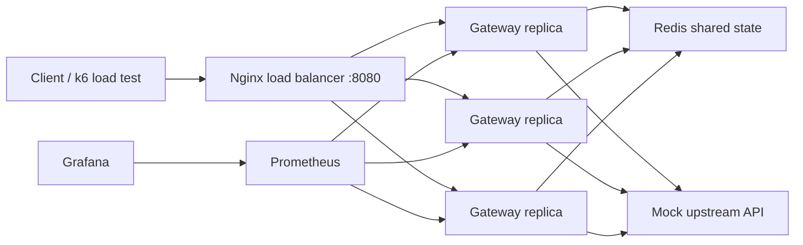

A lightweight distributed API gateway that adds rate limiting, caching, retries, circuit breaking, and observability to backend services without changing application code.

It is built as a backend infrastructure project: a Go gateway running across multiple replicas, Redis-backed shared state, Prometheus metrics, Grafana dashboards, and k6 load tests that measure p95/p99 latency and failure behavior.

## Architecture



## Features

- Reverse proxy with YAML route configuration.
- Redis-backed sliding-window rate limiting using an atomic Lua script.
- Per-route rate-limit keys by IP, arbitrary header, or named header mode.
- GET response caching with route-level TTL.
- Retry policy with exponential backoff for transient upstream failures.
- Circuit breaker that opens after repeated failures and recovers after cooldown.
- Structured JSON logs with request ID, route, status, cache status, rate-limit status, and latency.
- Prometheus metrics and a provisioned Grafana dashboard.
- k6 scripts for baseline, rate-limit, cache, failure, and scale experiments.

## Quickstart

Install the local developer tools:

```bash
brew install go k6
```

Start the full stack:

```bash
docker compose up --build --scale gateway=3
```

Open:

- Gateway: <http://localhost:8080>
- Prometheus: <http://localhost:9090>
- Grafana: <http://localhost:3000> using `admin` / `admin`

Try the gateway:

```bash
curl -i http://localhost:8080/api/products
curl -i http://localhost:8080/api/flaky -H 'X-User-ID: demo-user'
curl -i http://localhost:8080/api/error
curl -s http://localhost:9090/metrics | grep gatekeeper
```

Run tests:

```bash
go test ./...
```

Run load tests:

```bash
k6 run loadtests/baseline.js
k6 run loadtests/cache.js
k6 run loadtests/rate_limit.js
k6 run loadtests/upstream_failure.js
k6 run loadtests/scale.js
```

## Configuration

Routes live in [`deploy/docker/gateway.yaml`](deploy/docker/gateway.yaml).

```yaml
routes:
  - name: products
    path_prefix: /api/products
    upstream_url: http://mock-api:3000/products
    rate_limit:
      enabled: true
      key: ip
      limit: 100
      window_seconds: 60
    cache:
      enabled: true
      ttl_seconds: 30
    retry:
      enabled: true
      attempts: 2
      base_delay_ms: 50
    circuit_breaker:
      enabled: true
      failure_threshold: 5
      cooldown_seconds: 20
```

Rate-limit key modes:

- `key: ip` uses the first `X-Forwarded-For` address or remote IP.
- `key: header` uses the configured `header` field.
- `key: header:X-API-Key` reads that header directly.

If Redis is unavailable, the gateway fails open for rate limiting and bypasses cache so availability wins over strict enforcement.

## Metrics

Prometheus exposes the main project proof points:

- `gatekeeper_requests_total`
- `gatekeeper_request_duration_seconds`
- `gatekeeper_rate_limited_total`
- `gatekeeper_cache_events_total`
- `gatekeeper_upstream_errors_total`
- `gatekeeper_retries_total`
- `gatekeeper_circuit_state`

The Grafana dashboard visualizes request rate, p95/p99 latency, rate-limited requests, cache hit rate, upstream errors, and circuit state.

## Benchmark Log

Full benchmark runs should compare `--scale gateway=1` against `--scale gateway=3`.

| Scenario | Replicas | RPS | p95 latency | p99 latency | Notes |
| --- | ---: | ---: | ---: | ---: | --- |
| Baseline smoke | 3 | 18.69 | 8.73ms | 18.38ms | `k6 run --vus 2 --duration 5s loadtests/baseline.js` |
| Rate-limit smoke | 3 | 200.01 | 6.42ms | 11.75ms | `k6 run --vus 10 --duration 5s loadtests/rate_limit.js` |
| Baseline products | 1 | 244.99 | 6.02ms | 46.96ms | Maxed out single-instance capacity |
| Baseline products | 3 | 500.01 | 4.40ms | 8.31ms | Handled with ease (horizontal scaling) |
| Cache pressure | 3 | 999.94 | 2.20ms | 6.24ms | Ultra-low latency Redis cache hits |
| Rate-limit pressure | 3 | 200.02 | 6.11ms | 12.17ms | Global sliding-window enforcement |
| Upstream failure | 3 | 100.02 | 7.13ms | 13.68ms | Handled retries & circuit breaking |

## Failure Modes

- **Redis unavailable:** rate limiting fails open, cache is bypassed, requests continue to upstream.
- **Upstream intermittent 5xx:** gateway retries with exponential backoff, records retry/error metrics, and returns the final upstream response if all attempts fail.
- **Upstream repeated failure:** circuit breaker opens after the configured threshold and returns `503` until cooldown allows a half-open trial.
- **Multiple gateway replicas:** all replicas use Redis as shared state, so limits are enforced globally instead of per process.

## Resume Bullet

> Built a distributed API gateway in Go with Redis-backed sliding-window rate limiting, route-level caching, circuit breaking, Prometheus/Grafana observability, and k6 load tests across 3 gateway replicas, measuring p95/p99 latency and failure behavior under Redis/upstream outages.
