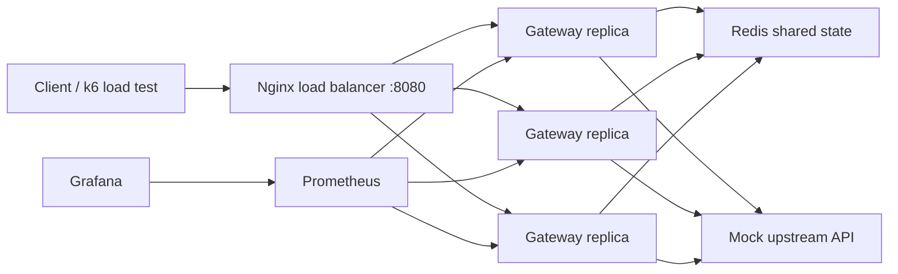

# GateKeeper


A distributed API gateway in Go — adds rate limiting, caching, retries, circuit breaking, and Prometheus observability to backend services across multiple replicas without changing application code.

## What This Demonstrates

| Skill | Implementation |
|---|---|
| Distributed systems | 3 gateway replicas sharing state through Redis; global rate limits enforced atomically across all processes |
| Go backend engineering | Idiomatic Go: interfaces, goroutines, structured JSON logging, YAML config parsing |
| Redis patterns | Atomic sliding-window rate limiter implemented as a Lua script to eliminate race conditions under concurrent replicas |
| Resilience engineering | Circuit breaker, exponential-backoff retry, and fail-open degradation when Redis is unavailable |
| Observability | 7 Prometheus counters/histograms, provisioned Grafana dashboard, structured per-request logs |
| Performance testing | k6 load tests across 5 scenarios; p95/p99 latency measured at up to 1,000 RPS with active circuit breaking and retries |
| Container orchestration | Multi-service Docker Compose stack: Nginx load balancer, 3 gateway replicas, Redis, Prometheus, Grafana |

## Architecture



## Benchmark Results

| Scenario | Replicas | RPS | p95 latency | p99 latency | Notes |
|---|---:|---:|---:|---:|---|
| Baseline smoke | 3 | 18.69 | 8.73ms | 18.38ms | Sanity pass |
| Rate-limit smoke | 3 | 200.01 | 6.42ms | 11.75ms | Global sliding-window active |
| Baseline products | 1 | 244.99 | 6.02ms | 46.96ms | Single-instance ceiling |
| Baseline products | 3 | 500.01 | 4.40ms | 8.31ms | **2× throughput, 5× p99 improvement** vs. 1 replica |
| Cache pressure | 3 | 999.94 | 2.20ms | 6.24ms | ~1,000 RPS via Redis cache |
| Rate-limit pressure | 3 | 200.02 | 6.11ms | 12.17ms | Global enforcement across all replicas |
| Upstream failure | 3 | 100.02 | 7.13ms | 13.68ms | Retries and circuit breaking active |

Scaling from 1 → 3 replicas doubled throughput and cut p99 latency from 46.96ms to 8.31ms on the products route.

## Features

- Reverse proxy with YAML route configuration.
- Redis-backed sliding-window rate limiting using an atomic Lua script.
- Per-route rate-limit keys by IP, arbitrary header, or named header mode.
- GET response caching with route-level TTL.
- Retry policy with exponential backoff for transient upstream failures.
- Circuit breaker that opens after repeated failures and recovers after cooldown.
- Structured JSON logs with request ID, route, status, cache status, rate-limit status, and latency.
- Prometheus metrics and a provisioned Grafana dashboard.
- k6 scripts for baseline, rate-limit, cache, failure, and scale experiments.

## Quickstart

```bash
# Install tools (macOS)
brew install go k6

# Start the full stack
docker compose up --build --scale gateway=3
```

| Service | URL | Credentials |
|---|---|---|
| Gateway | http://localhost:8080 | — |
| Prometheus | http://localhost:9090 | — |
| Grafana | http://localhost:3000 | `admin` / `admin` |

```bash
# Exercise the gateway
curl -i http://localhost:8080/api/products
curl -i http://localhost:8080/api/flaky -H 'X-User-ID: demo-user'
curl -i http://localhost:8080/api/error
curl -s http://localhost:9090/metrics | grep gatekeeper

# Unit tests
go test ./...

# Load tests
k6 run loadtests/baseline.js
k6 run loadtests/cache.js
k6 run loadtests/rate_limit.js
k6 run loadtests/upstream_failure.js
k6 run loadtests/scale.js
```

## Configuration

Routes are defined in [`deploy/docker/gateway.yaml`](deploy/docker/gateway.yaml):

```yaml
routes:
  - name: products
    path_prefix: /api/products
    upstream_url: http://mock-api:3000/products
    rate_limit:
      enabled: true
      key: ip
      limit: 100
      window_seconds: 60
    cache:
      enabled: true
      ttl_seconds: 30
    retry:
      enabled: true
      attempts: 2
      base_delay_ms: 50
    circuit_breaker:
      enabled: true
      failure_threshold: 5
      cooldown_seconds: 20
```

Rate-limit key modes:

| Mode | Behavior |
|---|---|
| `key: ip` | Uses `X-Forwarded-For` or remote IP |
| `key: header` | Uses the configured `header` field |
| `key: header:X-API-Key` | Reads the named header directly |

If Redis is unavailable, the gateway fails open — rate limiting and cache are bypassed so availability wins over strict enforcement.

## Metrics

| Metric | Description |
|---|---|
| `gatekeeper_requests_total` | Request count by route and status |
| `gatekeeper_request_duration_seconds` | Latency histogram (p50 / p95 / p99) |
| `gatekeeper_rate_limited_total` | Rate-limited requests by route |
| `gatekeeper_cache_events_total` | Cache hits and misses |
| `gatekeeper_upstream_errors_total` | Upstream error count |
| `gatekeeper_retries_total` | Retry attempts by route |
| `gatekeeper_circuit_state` | Circuit breaker state (0 = closed, 1 = open) |

The Grafana dashboard visualizes request rate, p95/p99 latency, cache hit rate, upstream errors, and circuit state in real time.

## Failure Modes

| Failure | Behavior |
|---|---|
| Redis unavailable | Fails open — rate limiting and cache bypass; requests continue to upstream |
| Upstream intermittent 5xx | Retries with exponential backoff; records retry and error metrics per attempt |
| Upstream sustained failure | Circuit breaker opens after threshold; returns `503` until cooldown half-open trial |
| Multiple gateway replicas | All replicas share Redis state — limits are enforced globally, not per process |